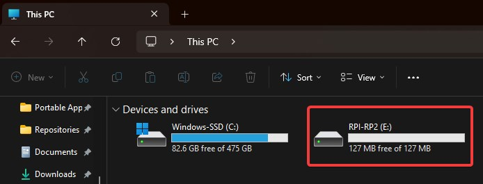

# Cloverpad MX Firmware

Rust-based firmware for the [Cloverpad MX](https://github.com/Cloverpad/cloverpad-hardware/tree/master/rev1), a 3-key mechanical keypad for osu! themed after MORE MORE JUMP! from Project Sekai.

## Installing Firmware

Plug the keypad PCB into your PC while holding down either:

- The `SEL` button on the back of the PCB
- The leftmost key (defaults to `Z`) - only works after flashing firmware for the first time

It should appear as a storage device:



Download the latest version of `cloverpad-mx-firmware-rs.uf2` from [GitHub Releases](https://github.com/Cloverpad/cloverpad-mx-firmware-rs/releases/latest), and copy it into the `RPI-RP2` storage device.

## Setting Up Development Environment

Make sure you have the following installed:

- Rust Stable (tested on 1.78.0)
- [`flip-link`](https://github.com/knurling-rs/flip-link?tab=readme-ov-file#installation)
- [`elf2uf2-rs`](https://github.com/jonil/elf2uf2-rs) (if you're loading firmware over USB)
- [`probe-rs`](https://probe.rs/docs/getting-started/installation/) (if you're using a debugging probe)

Add the `thumbv6m-none-eabi` compilation target via Rustup:

```bash
rustup target add thumbv6m-none-eabi
```

If you're using Linux, you'll also need to setup `udev` rules. Download a copy of [`udev/99-cloverpad.rules`](./ude`v/99-cloverpad.rules) and move it into `/etc/udev/rules.d`.

### Loading Firmware Over USB

To load firmware over USB, make sure that the default runner in [`.cargo/config.toml`](./.cargo/config.toml) is set to:

```toml
[target.'cfg(all(target_arch = "arm", target_os = "none"))']
runner = "elf2uf2-rs -d"
```

Plug the PCB into your PC while holding down the `SEL` button (labelled as `BOOTSEL` on Raspberry Pi Pico), which should make it appear as a storage device. Once it appears, use `cargo run` to load the firmware onto the PCB.

### Loading Firmware via Debugging Probe

**NOTE**: Cloverpad MX rev. 1 has no breakout pins for SWD and SWCLK, so a debugging probe can't be used

To load firmware via a debugging probe, make sure that the default runner in [`.cargo/config.toml`](./.cargo/config.toml) is set to:

```toml
[target.'cfg(all(target_arch = "arm", target_os = "none"))']
runner = "probe-rs run --chip RP2040 --protocol swd"
```

Wire up the debugging probe to the PCB (instructions for [Raspberry Pi Debug Probe](https://www.raspberrypi.com/documentation/microcontrollers/debug-probe.html)) and connect the PCB to your PC. Use `cargo run` to load the firmware onto the PCB.
